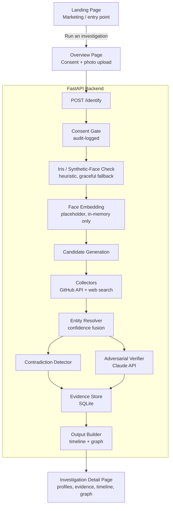

# DigiShield

**AI-powered digital identity resolution & evidence engine, with a synthetic-face liveness check.**

*NeuraX Hackathon 3.0 — Domain 3: AI in Cybersecurity*
*Team VANAVASAM*

[](https://vitejs.dev/)
[](https://fastapi.tiangolo.com/)
[](#license)

**Repo:** https://github.com/bhavya1101-cse/digishield-site
**Live site:** _TODO — add once deployed to Vercel_
**API:** _TODO — add once deployed to Render_

---

## Table of Contents

- [Overview](#overview)
- [Problem Statement](#problem-statement)
- [Key Features](#key-features)
- [System Architecture](#system-architecture)
- [Tech Stack](#tech-stack)
- [Project Structure](#project-structure)
- [Getting Started](#getting-started)
  - [Backend Setup](#backend-setup)
  - [Frontend Setup](#frontend-setup)
  - [Environment Variables](#environment-variables)
- [Running Locally](#running-locally)
- [API Reference](#api-reference)
- [Deployment](#deployment)
- [Responsible Design & Privacy](#responsible-design--privacy)
- [Known Limitations](#known-limitations)
- [Roadmap](#roadmap)
- [Team](#team)
- [License](#license)

---

## Overview

**DigiShield** is a single, unified web application — a public marketing/landing page and a working investigation dashboard, backed by a real FastAPI pipeline — built for the NeuraX Hackathon 3.0 *Public Profile & Digital Footprint Intelligence* problem statement.

Given a single organizer-provided, consented photo and limited context, DigiShield:

1. Screens the input photo with a heuristic **iris / synthetic-face check** before anything else runs.
2. Discovers, correlates, and verifies that person's public digital footprint into one evidence-backed identity.
3. Explicitly surfaces uncertainty and contradictions instead of guessing past them.

## Problem Statement

A person's public digital presence is scattered across platforms — GitHub, LinkedIn, X, Instagram, conference sites, publications — often under different usernames, aliases, or name variants. Manually correlating this is slow and error-prone, especially when names are common or profiles are incomplete, and most existing OSINT tools stop at "search and list" without ever verifying that the fragments actually belong to the same person.

## Key Features

| Feature | Description |
|---|---|
| 🧿 **Iris / synthetic-face check** | Heuristic pre-screen for likely AI-generated input photos, before the pipeline runs |
| 🧠 **Identity matching** | Multi-signal, explainable confidence score — not a single opaque number |
| 🔍 **Public profile discovery** | GitHub public API + web search, no login-walled scraping |
| 🔗 **Cross-source correlation** | Links matched profiles via real cross-references |
| ⚡ **Contradiction detection** | Flags disagreeing sources explicitly, never silently merges them |
| 🕵️ **Adversarial verification** | A second AI pass challenges every match before it's accepted |
| 📚 **Evidence-backed reporting** | Every finding carries a traceable source and confidence level |
| 📊 **Timeline & relationship graph** | Structured, sourced output — not a flat list of search hits |

## System Architecture



**Component notes:**

- **Iris / synthetic-face check** — runs immediately after consent, before the photo is used for anything else. Heuristic only (see [Known Limitations](#known-limitations)); degrades to `insufficient_data` rather than blocking the pipeline on a low-confidence flag.
- **Entity Resolver** — combines name similarity, org/city overlap, and link overlap into one explainable confidence score (`confidence_fusion.py`), rather than a single black-box number.
- **Contradiction Detector + Adversarial Verifier** run in parallel after resolution — one checks for disagreeing claims, the other challenges the match itself via the Anthropic API.
- **Evidence Store** — plain SQLite, one row per investigation, easy to inspect directly during development.

## Tech Stack

| Layer | Technology |
|---|---|
| Frontend | React 18, Vite, Tailwind CSS, React Router |
| Backend | Python, FastAPI, Pydantic |
| Database | SQLite |
| AI/LLM | Anthropic Claude API (structured extraction, contradiction summarization, adversarial verification) |
| Computer vision | OpenCV (`opencv-python-headless==4.10.0.84`, pinned — see [Known Limitations](#known-limitations)) |
| Discovery | GitHub REST API, web search (pluggable) |
| Deployment | Vercel (frontend), Render (backend) |

## Project Structure

```
digishield-site/
├── backend/
│   ├── app/
│   │   ├── main.py                        # FastAPI app entrypoint
│   │   ├── config.py                      # env-driven settings
│   │   ├── api/
│   │   │   ├── routes_identity.py         # POST /identify
│   │   │   ├── routes_profile.py          # GET /profile/{id}
│   │   │   └── routes_output.py           # GET /timeline/{id}, /graph/{id}
│   │   ├── pipeline/
│   │   │   ├── consent_gate.py
│   │   │   ├── iris_liveness_check.py     # synthetic-face heuristic
│   │   │   ├── face_embedding.py          # placeholder embedding
│   │   │   ├── candidate_generator.py
│   │   │   ├── collectors/
│   │   │   │   ├── base_collector.py
│   │   │   │   ├── github_collector.py
│   │   │   │   └── search_collector.py
│   │   │   ├── entity_resolver.py
│   │   │   ├── confidence_fusion.py
│   │   │   ├── contradiction_detector.py
│   │   │   ├── adversarial_verifier.py
│   │   │   ├── evidence_store.py
│   │   │   └── output_builder.py
│   │   ├── models/
│   │   │   └── schemas.py                 # Pydantic schemas (shared types)
│   │   └── utils/
│   │       └── text_similarity.py
│   ├── requirements.txt
│   └── .env.example
├── src/
│   ├── pages/
│   │   └── Landing.jsx                    # marketing / entry page
│   ├── app-pages/
│   │   ├── Overview.jsx                   # consent + upload form
│   │   ├── InvestigationDetail.jsx        # results dashboard
│   │   └── HowItWorks.jsx
│   ├── sections/                          # landing page sections
│   │   ├── Hero.jsx
│   │   ├── Features.jsx
│   │   ├── Differentiators.jsx
│   │   ├── DataSources.jsx
│   │   ├── Architecture.jsx
│   │   └── Footer.jsx
│   ├── components/                        # shared UI components
│   │   ├── ProfileCard.jsx
│   │   ├── EvidencePanel.jsx
│   │   ├── ConfidenceMeter.jsx
│   │   ├── ContradictionBadge.jsx
│   │   ├── Timeline.jsx
│   │   ├── RelationshipGraph.jsx
│   │   ├── DisambiguationPrompt.jsx
│   │   └── DashboardLayout.jsx
│   ├── lib/
│   │   └── api.js                         # backend API client
│   ├── App.jsx                            # router
│   └── main.jsx
├── vite.config.js                         # includes /api dev proxy -> :8000
├── tailwind.config.js
└── README.md
```

## Getting Started

### Backend Setup

```bash
cd backend
python -m venv venv
venv\Scripts\activate        # Windows
# source venv/bin/activate   # macOS/Linux

pip install -r requirements.txt
copy .env.example .env       # Windows
# cp .env.example .env       # macOS/Linux
```

Fill in `backend/.env` with your real values (see [Environment Variables](#environment-variables)). **Never commit `.env`** — only `.env.example` (with blank placeholders) is tracked.

### Frontend Setup

```bash
npm install
```

### Environment Variables

`backend/.env`:

```
ANTHROPIC_API_KEY=
SEARCH_API_KEY=
GITHUB_TOKEN=
DATABASE_URL=sqlite:///./digishield.db
USE_PLACEHOLDER_FACE_EMBEDDING=true
```

| Variable | Required | Purpose |
|---|---|---|
| `ANTHROPIC_API_KEY` | Yes, for adversarial verification | Claude API calls |
| `SEARCH_API_KEY` | Optional | Enables the generic web-search collector |
| `GITHUB_TOKEN` | Optional | Raises GitHub public API rate limit |
| `DATABASE_URL` | No (has default) | SQLite connection string |
| `USE_PLACEHOLDER_FACE_EMBEDDING` | No (defaults `true`) | Set `false` once a real face-embedding library is wired in |

## Running Locally

Two terminals, both running at the same time:

```bash
# Terminal 1 — backend
cd backend
venv\Scripts\activate
uvicorn app.main:app --reload
# -> http://127.0.0.1:8000

# Terminal 2 — frontend
npm run dev
# -> http://localhost:5173
```

Routes:
- `/` — landing page
- `/app` — run a new investigation (consent + upload)
- `/investigation/:id` — results dashboard
- `/how-it-works` — pipeline explainer

The Vite dev server proxies `/api/*` to `http://localhost:8000` (configured in `vite.config.js`) — both servers must be running for the app to work end-to-end locally.

## API Reference

| Method | Endpoint | Description |
|---|---|---|
| `POST` | `/identify` | Runs the full pipeline on a consented photo; returns an `Investigation` |
| `GET` | `/profile/{investigation_id}` | Fetch a previously run investigation |
| `GET` | `/timeline/{investigation_id}` | Chronological view of claims |
| `GET` | `/graph/{investigation_id}` | Relationship graph (nodes + edges) |
| `GET` | `/health` | Liveness check |
| `GET` | `/docs` | Interactive FastAPI/Swagger docs |

`POST /identify` request body:

```json
{
  "image_base64": "<base64 string>",
  "context": "Speaker at a regional tech conference",
  "name_hint": "Jane Doe",
  "consented": true,
  "source_note": "submitted via Overview page"
}
```

## Deployment

- **Frontend → Vercel.** Framework preset: Vite. Set an environment variable pointing the frontend's API client at the deployed backend URL (the local dev proxy in `vite.config.js` does not apply in production).
- **Backend → Render.** Deploy `backend/` as a Python web service; set `ANTHROPIC_API_KEY`, `SEARCH_API_KEY`, `GITHUB_TOKEN` in Render's environment settings — never in the repo.

_TODO: fill in the actual deployed URLs once live._

## Responsible Design & Privacy

- Input is restricted to an organizer-provided, consented photo for this demo — not arbitrary third-party photos.
- Only public, non-authenticated sources are queried (GitHub public API, public search) — no login bypass, no leaked-data sources.
- Low-confidence or conflicting findings are surfaced as **uncertain**, never silently resolved.
- Every consent check is audit-logged.
- The iris/synthetic-face check is a **prototype heuristic signal**, not a forensic verdict — see below.

## Known Limitations

Stated honestly, matching the code's own comments:

- **Iris/synthetic-face check** (`iris_liveness_check.py`) is a heuristic prototype using OpenCV Haar cascades and catchlight-consistency analysis — not a certified deepfake detector. It never blocks the pipeline; a `review_recommended` result flags rather than rejects.
- **Face embedding** (`face_embedding.py`) is currently a deterministic placeholder (a hash of the image bytes), not a real similarity model. `USE_PLACEHOLDER_FACE_EMBEDDING=false` requires wiring in a real library first.
- **Search collector** returns an empty list until a real search API key is configured — GitHub is currently the only fully working discovery source.
- **OpenCV version is pinned** to `4.10.0.84`: the latest release on PyPI at time of writing (`5.0.0`) is missing `cv2.CascadeClassifier` entirely and will break the iris check if installed unpinned.

## Roadmap

- Wire in a real face-embedding library (`face_recognition` or `insightface`)
- Real search API integration for non-GitHub platform discovery
- Human-in-the-loop review queue for low-confidence matches
- Exportable, source-cited investigation reports

## Team

**Team VANAVASAM** — NeuraX Hackathon 3.0

| Role | Name |
|---|---|
| Pipeline lead | Shashank |
| AI/extraction lead | Vineel |
| Frontend lead | Bhavya |
| Integration/docs lead | Anandh |

## License

_TODO — no license selected yet._